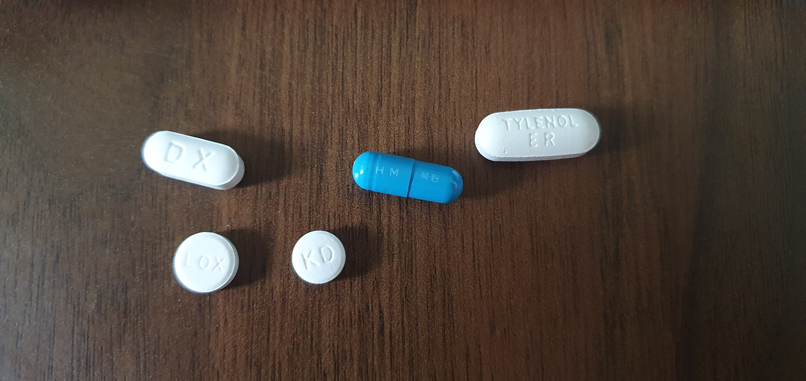
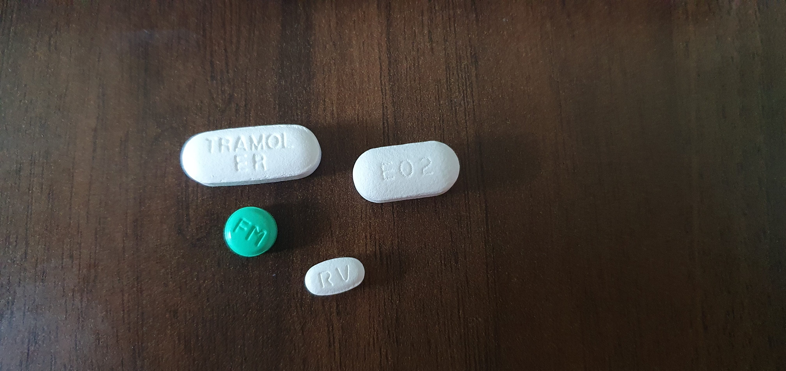

- [기존](#기존)
  - [액시마정](#액시마정)
  - [목틴](#목틴)
  - [레바미드정](#레바미드정)
  - [록스펜정](#록스펜정)
  - [타이레놀8시간이알서방정](#타이레놀8시간이알서방정)
- [신규](#신규)
  - [이든알마게이트정(아침,점심,저녁)](#이든알마게이트정아침점심저녁)
  - [휴텍스파모티딘정(아침,저녁)](#휴텍스파모티딘정아침저녁)
  - [레보세트린정(아침)](#레보세트린정아침)
  - [트라몰8시간서방정650mg(아침,점심,저녁)](#트라몰8시간서방정650mg아침점심저녁)

# 기존

## 액시마정
-호흡기관용약_진해거담제.png)

## 목틴
-호흡기관용약_진해거담제.png)

## 레바미드정
-소화기관용약_소화성궤양용제.png)

## 록스펜정
-중추신경계용약_해열진통소염제.png)

## 타이레놀8시간이알서방정
-중추신경계용약_해열진통소염제.png)

          

# 신규

## 이든알마게이트정(아침,점심,저녁)
-소화기관용약_제산제.png)

## 휴텍스파모티딘정(아침,저녁)
-소화기관용약_소화성궤양용제.png)

## 레보세트린정(아침)
-알레르기용약_항히스타민제.png)

## 트라몰8시간서방정650mg(아침,점심,저녁)
-중추신경계용약_해열진통소염제.png)